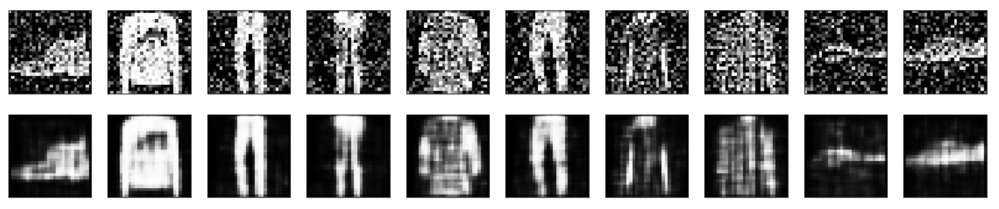

# Image Denoising using AutoEncoders
Image denoising is an important pre-processing step in image analysis. Experimenting with autoencoder based techniques, I have created this small project to learn the concept behind autoencoders and how they can be used for denoising images without supervised learning.

Trained on MNIST fashion Dataset

## Sample output
